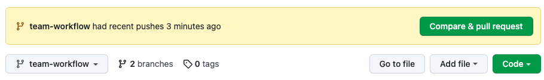
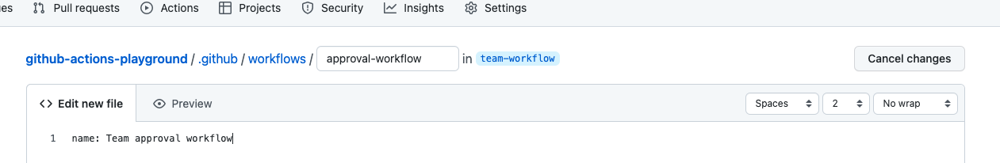
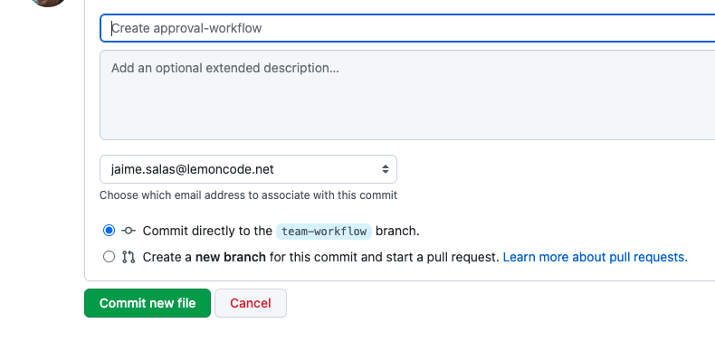
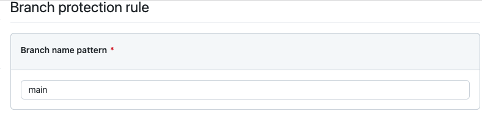
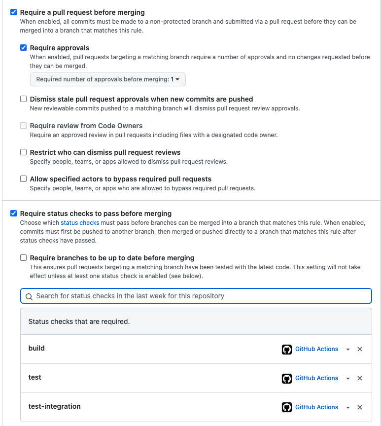
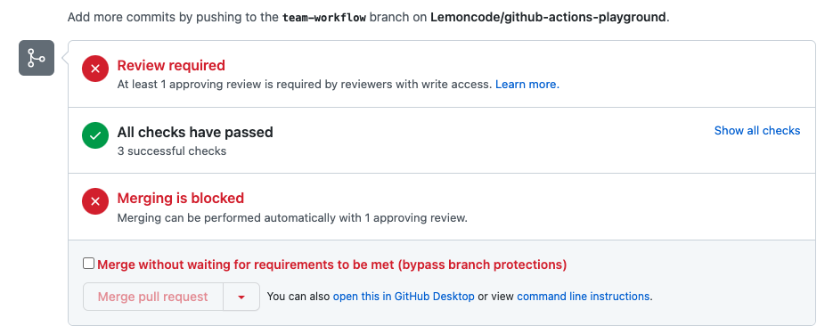
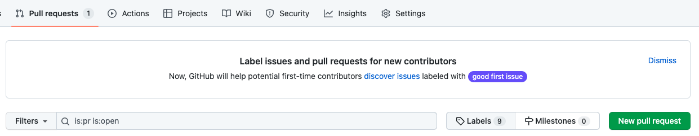
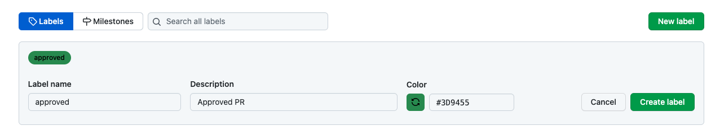

# Approval Protection

* Branch protections
* Required reviews
* Obvious approvals

These last three remaining items don't really belong in a code, build, and test pipeline because they have more to do with the processes that involve human interaction rather than build and test automation. 

However, configuration as code is important, and improving how you automate and version control your configurations is going to be key in how you are able to scale and innovate moving forward. So because of this, GitHub Actions allow you to run multiple workflows for different event triggers, which allow you to create separate workflow files within the same project repository. So let's create a new approval workflow to satisfy the remaining items on our list.

Let's start by updating the `ci.yml` trigger events

```yml
name: CI 

on:
  push:
    branches: [ main ]
    
  pull_request:
    branches: [ main ]
```

```bash
git add .
git commit -m "back to original triggers"
git push
```

Let's start by creating a new branch

```bash
git checkout -b team-workflow
git push -u origin team-workflow
```

Let's create a simple `markdown` that recall us the automation process goals.

* Create `automation.md` om root project:

```
# Automation Goals

* Branch protections
* Required reviews
* Obvious approvals
```

```bash
git add .
git commit -m "added automation notes"
git push
```

Once the push is completed, let's navigate back to the Code tab of our repository on GitHub. 

GitHub now notices that we've recently pushed up a new branch to our project with a helpful prompt to then create a pull request as a common next step. But for now, let's hold off on creating a pull request from this branch and let's add a workflow file to it. 

The file that is being introduced to this branch is an `automation.md` file. This is just a markdown file with the list of the items that we need to be checked off. We haven't added a new workflow file to this branch as of yet, so let's do that right now. 

Even though we just pushed up a new branch, we're still on the default main branch. 

So let's switch to the **team‑workflow branch** on GitHub by clicking on the branch drop‑down button below the Code tab and selecting our **team‑workflow branch**. 



Now that we're working on our new branch, let's add a new workflow file by navigating to the `.github/workflows` folder and creating a new file called `approval‑workflow.yml`. 

* Create `.github/workflows/approval-workflow.yml`



* Submit the file from GitHub site.



And returning to the Code tab, let's click on the prompt to create the pull request from this branch. 

* Create a new pull request from tab code

Now it's worth mentioning that after a period of time, this pull request prompt will disappear so it doesn't persist if you intend to push up a branch, but not open up a pull request right away. So if the prompt doesn't show or it disappears, you can always navigate to the Pull requests tab and then create your pull requests from there. 

* Let's give our pull request with:
    * PR title - *"Approval Workflow"*
    * PR body - *"This pull request adds an approval workflow to the project"*
    * Create PR

Notice that although we don't have anything other than a name in our workflow file, our CI checks are running from our previous workflow. 

Since we merged those changes to our main branch and, in our previous workflow, our event triggers are a push to main or a pull request into main, our CI checks will run, which is why we're seeing them here. So this is running exactly as expected.

Workflows can be configured to run by using events from GitHub, such as event webhooks. This is what we did in our workflow file with configuring it to run on a push or a pull request event. You can also configure it to run at a scheduled time with scheduled events or when an event outside of GitHub occurs with `repository_dispatch`.

## Obvious approval

Now for a review‑type workflow, we want to engage with human interaction and reviews.

* Update `apprval-workflow.yml`

```yml
name: Team approval workflow
# diff #
on:
  - pull_request_review
# diff #
```

```bash
git add .
git commit -m "triggers on pull request review"
git push
```

> Our approval workflow will now initiate when a pull request review occurs.

What we're going to do next is add an approved label when the PR is approved. Now let's add a new job:

* Update `apprval-workflow.yml`

```yml
name: Team approval workflow

on:
  - pull_request_review
# diff #
jobs:
  label-when-approved:
    runs-on: ubuntu-latest
# diff #
```

```bash
git add .
git commit -m "added trigger event"
```

Let's use a community‑created action for a next step. So let's navigate to the GitHub Marketplace at [github.com/marketplace](https://github.com/marketplace). 

From here, we can search for community actions from the search bar or by narrowing our search by selecting actions on the left sidebar and then searching for the action that you want. Let's search for the action *label approved pull requests*.

* [Label approved pull request](https://github.com/marketplace/actions/label-approved-pull-requests)

This action will apply a label of our choosing to a pull request that reaches a specified number of approvals. With the use of this action, when a pull request is approved, it will automate the process of applying this label to the pull request. And at the top of this page, you can copy the necessary code snippet on the latest version of this action that we will then need to add to our workflow file. 

* Update `.github/workflows/approval-workflow.yml`

```yml
jobs:
  label-when-approved:
    runs-on: ubuntu-latest
    # diff #
    steps:
      - name: Label approved pull requests
        uses: abinoda/label-when-approved-action@1.0.5
        env: 
          APPROVALS: "1"
          GITHUB_TOKEN: ${{ secrets.GITHUB_TOKEN }}
          ADD_LABEL: "approved"
    # diff #     
```

As a side note, if we have another action that applies, let's say, a needs review label to a new pull request, we could add another environment variable, such as `remove_label` as the key and then the name of the label as the value that would be removed when this action is validated. Now let's commit these changes.

```bash
git add .
git commit -m "added label when approved action"
```

This action does is apply a new label based on a number of approving reviews. Anyone can still merge in this pull request if they want, which isn't ideal if we want an approval before merging. 

So with this action we have satisfied another checklist item of applying a way to see an **obvious approval on a pull request**. 

But we now want to extend this functionality by adding a way to prevent a premature merge without an approval. And we can do this by checking another item off of our checklist with **adding branch protections**.

## Create Branch protection

> By default, any pull request could be merged at any time unless the head branch is in conflict with the base branch.

You can choose to enforce restrictions on how a pull request is merged into your repository by using branch protections. Now we've seen how we can automate some pull request features related to approvals, but we can use these branch protections to enforce required status checks or approvals to occur before a merge can be allowed. 

Navigating back to our GitHub repository, let's add some branch protections to our main branch. We can do this by navigating to the **Settings tab** at the top and under the **Branches** option in the left sidebar and click on **Add rule** under the branch protection rules. 

* Settings tab -> Branches -> Add Rule


From here, we need to identify which branch we want to apply these branch protections to, so let's type the `main` branch.



Next, we need to select which protections we want to include on this branch, so let's select **Require a pull request before merging**. This will require an approving review before the pull request can be allowed to merge. 

And then let's check **Require status checks to pass before merging**. This branch protection will allow us to choose which checks are required to pass before the pull request can be allowed to merge. Now if an important test fails that is checked in this list, even if the pull request has an approving review, it won't be allowed to merge. So let's check our build and then the test checks:

* build
* test
* test-integration



Let's now click **Create** at the bottom of this page, and you may be prompted to input your GitHub password as authentication to repository settings that are being changed.

From here, let's navigate back to our pull request from the Pull requests tab. And scrolling down to the bottom, we now see that we have a red Merging is blocked message on our pull request.



This is a result from our new branch protections because this pull request now requires an approving review. But as admin access to this repository, I can actually bypass this and merge it in without a review. And in your case, unless you have someone that will review this pull request, you will need to either remove the branch protection or just use those admin powers to force‑merge this pull request.

* Ask a lemon member to review - **Nasdan**

But first, let's create a label with the name approved so that our workflow file can work. 

We can do this by going to the `Labels` section on the right and scroll down to the Edit labels option at the bottom. Let's now click on the **New label** button on the right and input approved and then choose a color. You can enter in a specific color hue or filter through a random selection of colors until you find the color that works. For our approval, let's look for some sort of a green color. 

* **Pull requests tab**
    - **Labels**
        - **New Label**
            - Label name: `approved`
            - Color: `green`




Returning back to our pull request, we should be all set for a team member or a contributor of this project to review our pull request. 

I've asked my good friend `Nasdan` to approve these changes.  

Now when `Nasdan` approves this pull request, we should see our github‑actions bot automatically apply the approved label to this pull request, and a red message to block the pull request from our branch protection should now be lifted, and we should see all green checks and the approval to now merge. 

With these latest updates, we have now satisfied the remaining two checklist items with the addition of branch protections to our master branch and the check for required reviews before merging.
