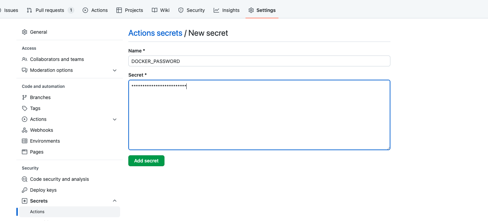

# Continous Delivery

After achieve CI, the next step is get the new changes in our code and prepare them to get into production. In our case, we're going to create a new Docker image and push it to a Docker Registry. We're going to use Docker Hub, but any other registry or any other artifactory will be analogus.

## Pre requisites

* Docker or Docker Desktop installed
* Docker Hub account

## Building the Docker Image Locally

Before adding the required steps into our workflow, let's try it on local.

First from `hangman-api` root directory run:

```bash
docker build -t jaimesalas/hangman-api .
```

And test by running:

```bash
docker run -d -p 3000:3000 jaimesalas/hangman-api
```

```bash
curl localhost:3000/api/topics
```

We could also push it to Docker Hub

```bash
docker login # Just if not already logged
docker push jaimesalas/hangman-api
```

## Building the Docker Image in a workflow

First of all, let's create a new branch for this new feature

```bash
git checkout -b add-cd-workflow
git push -u origin add-cd-workflow
```

Before we move into our workflow and add the delivery job, let's have a look into our Dockerfile

```Dockerfile
#------------------------------------------------------------------------------
# -- builder
#------------------------------------------------------------------------------
FROM node:lts-alpine as builder

WORKDIR /app
COPY . .

RUN npm ci
RUN npm run build

#------------------------------------------------------------------------------
# -- app
#------------------------------------------------------------------------------
FROM node:lts-alpine as app

WORKDIR /app
COPY --from=builder /app/dist .
COPY package.json .
COPY package-lock.json .

ENV NODE_ENV=production

RUN npm install

CMD ["npm", "start"]
```

Notice the first part of this `Dockerfile` is doing exctly the same as what we're already doing in our `build` job. It wouldn't be nice that we can use the built job here? Let's give a try.

* Create `Dockerfile.workflow`

```Dockerfile
FROM node:lts-alpine as app

WORKDIR /app
COPY dist/ .
COPY package.json .
COPY package-lock.json .

ENV NODE_ENV=production

RUN npm install

CMD ["npm", "start"]
```

* What if we would like to change the node image used during build time? We can make use of an `ARG` variable.

```diff
+ ARG version=lts-alpine
+ FROM node:${version} as app
- FROM node:lts-alpine as app

WORKDIR /app
COPY dist/ .
COPY package.json .
COPY package-lock.json .

ENV NODE_ENV=production

RUN npm install

CMD ["npm", "start"]
```

We should use the following command to build an image with an specific Node.js version:

```bash
docker build -t jtrillo/hangman-api -f Dockerfile.workflow --build-arg version=20.10-alpine .
```

First, we're going to use the same build job as the one on `ci.yml`. But here we're going to upload the build as an artifact to be used on a new `delivery` job:

* Create `.github/workflows/cd-docker.yml`

```yml
name: Docker Image API

on:
  workflow_dispatch:

jobs:
  build:
    runs-on: ubuntu-latest

    steps:
      - uses: actions/checkout@v4
      - uses: actions/setup-node@v4
        with: 
          node-version: 16
          cache: 'npm'
          cache-dependency-path: hangman-api/package-lock.json
      - name: build
        working-directory: ./hangman-api
        run: |
          npm ci 
          npm run build --if-present
      - uses: actions/upload-artifact@v3 
        with:
          name: build-code
          path: hangman-api/dist/
```

Now we need to build the image before push it to Docker registry we can do this as follows:

```yml
  # diff #
  delivery:
    
    runs-on: ubuntu-latest
    needs: build

    steps:
    - uses: actions/checkout@v4
    - uses: actions/download-artifact@v3
      with:
        name: build-code
        path: hangman-api/dist/
    - name: Build the Docker image
      working-directory: ./hangman-api
      run: docker build -t hangman-api:$(date +%s) -f Dockerfile.workflow .
  # diff #
```

Push the new changes:

```bash
git add .
git commit -m "added cd workflow"
git push
```

We can try the job now and check how the Docker image is built.

## Pushing the Docker Image in a workflow

Ok, almost done. There are prebaked actions to authenticate and push Docker images, but in this case we're going to use a run command. First of all, we need to create a new secret to authenticate ourselves against Docker Hub.

> Go to Repository Settings > Secrets and variables > Actions > New repository secret \
> When creating the secret in GitHub website, text is visible. Take care if you are sharing your screen :)



```diff
-   - name: Build the Docker Image
+   - name: Build and Push Docker Image
      working-directory: ./hangman-api
+     env:
+       DOCKER_USER: "jaimesalas"
+       DOCKER_REPOSITORY: "hangman-api"
+       DOCKER_PASSWORD: ${{ secrets.DOCKER_PASSWORD }}
-     run: docker build . --file Dockerfile.workflow --tag my-image-name:$(date +%s)
```

And add the multiline run operation

```yml
run: | 
  echo $DOCKER_PASSWORD | docker login --username $DOCKER_USER --password-stdin
  image=$DOCKER_USER/$DOCKER_REPOSITORY:$(date +%s)
  docker build -t $image -f Dockerfile.workflow .
  docker push $image
```

Push the new changes:

```bash
git add .
git commit -m "added push docker image step"
git push
```

And fire the workflow from GitHub site. If everything works we must see something like this:

```console
 ---> 12c19641de84
Successfully built 12c19641de84
Successfully tagged jaimesalas/hangman-api:1665501807
The push refers to repository [docker.io/jaimesalas/hangman-api]
```

And visit Docker Hub to find out the uploaded image

## Extra: building and pushing a docker image to Docker Hub using actions

In this case, we will use actions instead of commands. We are going to make use of the following actions:

* [docker/login-action](https://github.com/marketplace/actions/docker-login)
* [docker/setup-buildx-action](https://github.com/marketplace/actions/docker-setup-buildx)
* [docker/build-push-action](https://github.com/marketplace/actions/build-and-push-docker-images)

Let's add a new job to our workflow.

```yaml
  buildAndPush:
    runs-on: ubuntu-latest
    needs: build

    steps:
      - name: Checkout repo
        uses: actions/checkout@v4
      - name: Download dist folder as artifact
        uses: actions/download-artifact@v3
      - name: Docker Hub login
        uses: docker/login-action@v3
        with:
          # registry: by default is set to Docker Hub
          username: jtrillo
          password:  ${{ secrets.DOCKER_PASSWORD }}
      - name: Set up Docker Buildx
        uses: docker/setup-buildx-action@v3
      - name: Build and push Docker Image
        uses: docker/build-push-action@v5
        with:
          context: ./hangman-api
          push: true
          tags: jtrillo/hangman-api-actions:latest
          file: ./hangman-api/Dockerfile.workflow
```

Push the new changes

```bash
git add .
git commit -m "added buildAndPush job"
git push
```

And, finally, let's fire again the workflow.

## Reference

* [What is Continous Delivery?](https://aws.amazon.com/devops/continuous-delivery/)
* [Trigger a workflow from another workflow](https://github.com/orgs/community/discussions/26294)
* [Repository dispatch](https://github.com/peter-evans/repository-dispatch)
